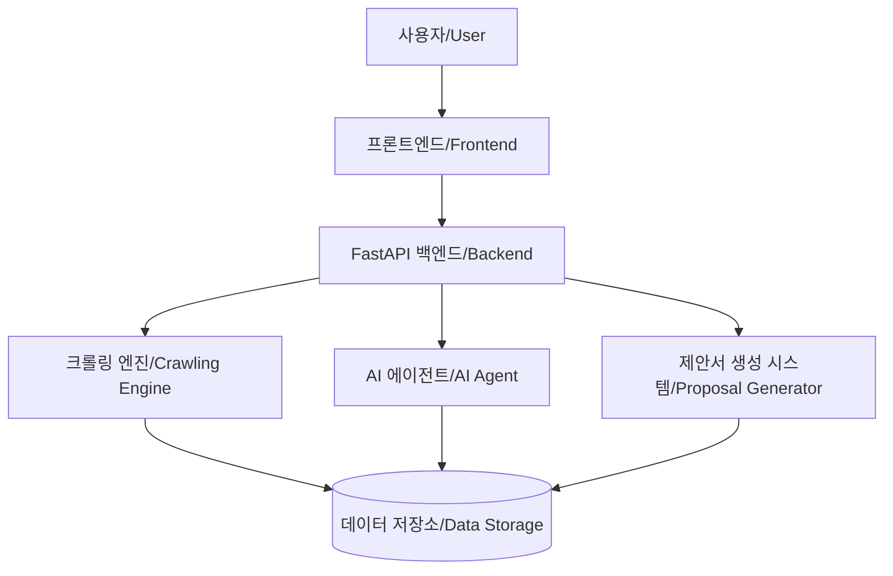

# 🚀 PROGEN (공공 조달 프로젝트 제안서 생성 지원 도구)
# 🚀 PROGEN (Public Procurement Project Proposal Generation Tool)

<div align="center">


[](https://www.python.org/)
[](https://fastapi.tiangolo.com/)
[](https://developer.mozilla.org/en-US/docs/Web/JavaScript)
[](LICENSE)
[](https://github.com/EnzoMH)

</div>

**[KR]** PROGEN은 나라장터 크롤링과 인공지능 기술을 활용하여 공공 조달 입찰 정보를 수집하고, 이를 기반으로 제안서 작성을 지원하는 웹 애플리케이션입니다.

**[EN]** PROGEN is a web application that collects public procurement bid information using KONEPS (Korea ON-line E-Procurement System) crawling and AI technology, and supports proposal writing based on this information.

---

## 📋 목차 (Table of Contents)

- [주요 기능 (Key Features)](#-주요-기능-key-features)
- [시스템 아키텍처 (System Architecture)](#-시스템-아키텍처-system-architecture)
- [설치 방법 (Installation)](#-설치-방법-installation)
- [실행 방법 (Execution)](#-실행-방법-execution)
- [사용 가이드 (User Guide)](#-사용-가이드-user-guide)
- [오류 해결 (Troubleshooting)](#-오류-해결-troubleshooting)
- [개발자 정보 (Developer Information)](#-개발자-정보-developer-information)
- [라이선스 (License)](#-라이선스-license)

---

## ✨ 주요 기능 (Key Features)

### 🔍 나라장터 크롤링 (KONEPS Crawling)
**[KR]**
- 키워드 기반 입찰 공고 검색 및 수집
- 날짜 범위 지정 검색 지원
- 실시간 진행 상황 모니터링
- 수집 결과 다운로드 (Excel, JSON 형식)

**[EN]**
- Keyword-based bid announcement search and collection
- Date range search support
- Real-time progress monitoring
- Download collection results (Excel, JSON format)

### 🤖 AI 에이전트 크롤링 (AI Agent Crawling)
**[KR]**
- AI 비전 기술을 활용한 지능형 크롤링
- 웹사이트 구조 변경에도 안정적인 정보 추출
- 기존 크롤러 실패 시 자동 대체 모드

**[EN]**
- Intelligent crawling using AI vision technology
- Stable information extraction even with website structure changes
- Automatic fallback mode when conventional crawler fails

### 📝 제안서 작성 지원 (Proposal Writing Support)
**[KR]**
- 수집된 입찰 정보 기반 제안서 템플릿 생성
- 유사 프로젝트 참조 기능
- 맞춤형 제안서 컨텐츠 제안

**[EN]**
- Generate proposal templates based on collected bid information
- Similar project reference feature
- Customized proposal content suggestions

---

## 🏗️ 시스템 아키텍처 (System Architecture)



### 📂 디렉토리 구조 (Directory Structure)

```
PROGEN/
├── static/                      # 정적 파일 디렉토리 (Static Files Directory)
│   ├── css/
│   │   └── style.css           # 메인 스타일시트 (Main Stylesheet)
│   ├── js/
│   │   ├── crawl.js            # 크롤링 페이지 스크립트 (Crawling Page Script)
│   │   ├── home.js             # 홈페이지 스크립트 (Homepage Script)
│   │   ├── login.js            # 로그인 페이지 스크립트 (Login Page Script)
│   │   ├── crawlutil/          # 크롤링 유틸리티 모듈 (Crawling Utility Module)
│   │   │   ├── index.js        # 크롤링 유틸리티 진입점 (Crawling Utility Entry Point)
│   │   │   ├── api-service.js  # API 호출 서비스 (API Call Service)
│   │   │   ├── websocket.js    # WebSocket 관리 클래스 (WebSocket Manager)
│   │   │   ├── logger.js       # 로깅 유틸리티 (Logging Utility)
│   │   │   └── dom-helper.js   # DOM 조작 헬퍼 함수 (DOM Manipulation Helper)
│   │   └── home/               # 홈페이지 모듈 (Homepage Module)
│   │       ├── index.js        # 홈페이지 스크립트 진입점 (Homepage Script Entry Point)
│   │       ├── auth.js         # 인증 관련 기능 (Authentication Features)
│   │       ├── fileManager.js  # 파일 관리 기능 (File Management)
│   │       ├── chatManager.js  # 채팅 관리 기능 (Chat Management)
│   │       ├── ui.js           # UI 컴포넌트 (UI Components)
│   │       └── utils.js        # 유틸리티 함수 (Utility Functions)
│   ├── image/                  # 이미지 리소스 디렉토리 (Image Resources Directory)
│   │   ├── meta.png            # Meta 모델 아이콘 (Meta Model Icon)
│   │   ├── claude.png          # Claude 모델 아이콘 (Claude Model Icon)
│   │   └── gemini.png          # Gemini 모델 아이콘 (Gemini Model Icon)
│   ├── home.html               # 홈페이지 (Homepage)
│   ├── crawl.html              # 크롤링 페이지 (Crawling Page)
│   └── login.html              # 로그인 페이지 (Login Page)
│
├── backend/                     # 백엔드 코어 디렉토리 (Backend Core Directory)
│   ├── __init__.py 
│   ├── crawl.py                # 크롤링 기능 컨트롤러 (Crawling Function Controller)
│   ├── login.py                # 로그인/인증 관련 유틸리티 (Login/Auth Utility)
│   ├── utils/                  # 유틸리티 함수 디렉토리 (Utility Functions Directory)
│   │   ├── __init__.py        
│   │   ├── agent/              # AI 에이전트 관련 파일 (AI Agent Files)
│   │   │   ├── __init__.py
│   │   │   └── ai.py           # AI 관련 핵심 클래스 및 함수 (AI Core Classes and Functions)
│   │   ├── db/                 # 데이터베이스 관련 파일 (Database Files)
│   │   │   ├── __init__.py
│   │   │   └── models.py       # 데이터베이스 모델 (Database Models)
│   │   ├── crawl/              # 크롤러 관련 파일 (Crawler Files)
│   │   │   ├── __init__.py
│   │   │   ├── README.md       # 크롤링 모듈 문서 (Crawling Module Documentation)
│   │   │   ├── models.py       # 크롤링 데이터 모델 (Pydantic) (Crawling Data Models)
│   │   │   ├── crawler.py      # 나라장터 크롤러 구현 (KONEPS Crawler Implementation)
│   │   │   ├── crawler_manager.py  # 크롤러 관리자 클래스 (Crawler Manager Class)
│   │   │   ├── ai_agent.py     # AI 에이전트 크롤링 구현 (AI Agent Crawling Implementation)
│   │   │   ├── core/           # 코어 컴포넌트 (Core Components)
│   │   │   └── utils/          # 크롤링 유틸리티 (Crawling Utilities)
│   │   └── prop/               # 제안서 생성 관련 파일 (Proposal Generation Files)
│   │       ├── __init__.py
│   │       ├── dc.py           # 문서 처리 함수, DocumentProcessor (Document Processing)
│   │       └── pg.py           # 제안서 생성 함수, ProposalGenerator (Proposal Generation)
│
├── data/                        # 데이터 저장 디렉토리 (Data Storage Directory)
├── export/                      # 내보내기 파일 디렉토리 (Export Files Directory)
├── logs/                        # 로그 파일 디렉토리 (Log Files Directory)
├── test/                        # 테스트 코드 디렉토리 (Test Code Directory)
│
├── .env                         # 환경 변수 설정 (Environment Variables Configuration)
├── .gitignore                   # Git 무시 파일 목록 (Git Ignore File List)
├── app.py                       # FastAPI 메인 애플리케이션 (FastAPI Main Application)
├── chat.py                      # 채팅 모듈 (Chat Module)
├── dbcon.py                     # 데이터베이스 연결 설정 (Database Connection Settings)
├── docpro.py                    # 문서 처리 모듈 (Document Processing Module)
├── debug.py                     # 디버깅 유틸리티 (Debugging Utility)
├── directory.txt                # 디렉토리 구조 문서 (Directory Structure Document)
├── requirements.txt             # 프로젝트 의존성 목록 (Project Dependencies List)
├── server.log                   # 서버 로그 파일 (Server Log File)
└── users.json                   # 사용자 정보 데이터 (User Information Data)
```

---

## 📥 설치 방법 (Installation)

### 필수 요구사항 (Prerequisites)

**[KR]**
- ✅ Python 3.9 이상
- ✅ Chrome 웹 브라우저 (크롤링용)

**[EN]**
- ✅ Python 3.9 or higher
- ✅ Chrome web browser (for crawling)

### 1️⃣ 저장소 복제 (Clone Repository)

```bash
git clone https://github.com/EnzoMH/progen.git
cd progen
```

### 2️⃣ 가상환경 설정 (Virtual Environment Setup)

**[KR]**
```bash
# 가상환경 생성
python -m venv venv

# 가상환경 활성화
# Windows:
venv\Scripts\activate
# macOS/Linux:
source venv/bin/activate
```

**[EN]**
```bash
# Create virtual environment
python -m venv venv

# Activate virtual environment
# Windows:
venv\Scripts\activate
# macOS/Linux:
source venv/bin/activate
```

### 3️⃣ 패키지 설치 (Package Installation)

```bash
pip install -r requirements.txt
```

### 4️⃣ 환경 변수 설정 (Environment Variables Setup)

**[KR]**
`.env` 파일을 프로젝트 루트 디렉토리에 생성하고 다음과 같이 설정:

**[EN]**
Create a `.env` file in the project root directory and configure as follows:

```
DB_CONNECTION_STRING=mongodb://localhost:27017
SECRET_KEY=your-secret-key
DEBUG=True
```

---

## 🚀 실행 방법 (Execution)

### 개발 모드 (Development Mode)

**[KR]**
```bash
python app.py
```
애플리케이션은 `http://localhost:8000`에서 실행됩니다.

**[EN]**
```bash
python app.py
```
The application runs at `http://localhost:8000`.

---

## 📖 사용 가이드 (User Guide)

### 🔑 로그인 및 시작하기 (Login and Getting Started)

**[KR]**
1. 웹 브라우저에서 `http://localhost:8000`으로 접속
2. 로그인 페이지에서 계정 정보 입력 (기본 계정: admin/admin)
3. 메인 화면에서 기능 선택:
   - 🔍 **크롤링**: 나라장터 입찰 정보 수집
   - 📝 **제안서 작성**: 제안서 생성 및 편집

**[EN]**
1. Access `http://localhost:8000` in your web browser
2. Enter account information on the login page (default account: admin/admin)
3. Select a feature from the main screen:
   - 🔍 **Crawling**: Collect KONEPS bid information
   - 📝 **Proposal Writing**: Generate and edit proposals

### 👨‍💻 크롤링 기능 사용하기 (Using Crawling Features)

<details>
<summary><b>표준 크롤링 (Standard Crawling)</b></summary>

**[KR]**
1. 탐색 메뉴에서 '크롤링' 선택
2. '표준 크롤링' 탭 선택
3. 검색 키워드 입력 (쉼표로 구분)
4. 검색 기간 설정 (시작일/종료일)
5. '크롤링 시작' 버튼 클릭
6. 실시간 진행 상황 모니터링
7. 완료 후 '결과 다운로드' 버튼 클릭

**[EN]**
1. Select 'Crawling' from the navigation menu
2. Choose the 'Standard Crawling' tab
3. Enter search keywords (comma-separated)
4. Set the search period (start date/end date)
5. Click the 'Start Crawling' button
6. Monitor real-time progress
7. Click the 'Download Results' button after completion
</details>

<details>
<summary><b>AI 에이전트 크롤링 (AI Agent Crawling)</b></summary>

**[KR]**
1. 크롤링 페이지에서 'AI 에이전트 크롤링' 탭 선택
2. 검색 키워드 입력
3. 필요에 따라 '강제 AI 에이전트 모드' 옵션 설정
4. 'AI 에이전트 크롤링 시작' 버튼 클릭
5. 에이전트 진행 상황 모니터링

**[EN]**
1. Select the 'AI Agent Crawling' tab on the crawling page
2. Enter search keywords
3. Set the 'Force AI Agent Mode' option if needed
4. Click the 'Start AI Agent Crawling' button
5. Monitor agent progress
</details>

### 📊 크롤링 결과 활용하기 (Utilizing Crawling Results)

**[KR]**
수집된 데이터는 다음과 같은 형태로 제공됩니다:

**[EN]**
Collected data is provided in the following format:

```json
{
  "results": [
    {
      "bid_id": "20231234567",
      "title": "소프트웨어 개발 사업",
      "organization": "한국정보화진흥원",
      "bid_type": "일반경쟁",
      "date": "2023-03-15"
    }
  ]
}
```

---

## 🛠️ 오류 해결 (Troubleshooting)

### 자주 발생하는 문제 (Common Issues)

| 문제 (Issue) | 해결 방법 (Solution) |
|------|----------|
| **🔴 llama_cpp 모듈 오류<br>(llama_cpp module error)** | `pip install llama-cpp-python` 명령으로 별도 설치<br>(Install separately with `pip install llama-cpp-python` command) |
| **🔴 ChromeDriver 오류<br>(ChromeDriver error)** | Chrome 브라우저 설치 확인 및 업데이트<br>(Check Chrome browser installation and update) |
| **🔴 WebSocket 연결 오류<br>(WebSocket connection error)** | 방화벽 설정 확인 및 서버 재시작<br>(Check firewall settings and restart the server) |

### 로그 확인 (Log Checking)

**[KR]**
오류 발생 시 `server.log` 파일을 확인하여 자세한 오류 메시지를 확인할 수 있습니다:

**[EN]**
When an error occurs, you can check the `server.log` file for detailed error messages:

```bash
# 마지막 50줄의 로그 확인 (Check the last 50 lines of log)
tail -n 50 server.log
```

---

## 👨‍💻 개발자 정보 (Developer Information)

**[KR]**
PROGEN은 EnzoMH에 의해 단독 개발된 프로젝트입니다. 이 도구는 공공 조달 시장의 정보 접근성 향상과 효율적인 제안서 작성을 지원하기 위해 개발되었습니다.

**[EN]**
PROGEN is a project solely developed by EnzoMH. This tool was developed to improve information accessibility in the public procurement market and support efficient proposal writing.

- 🧑‍💻 개발자 (Developer): [EnzoMH](mailto:your-email@example.com)
- 🌐 GitHub: [https://github.com/EnzoMH](https://github.com/EnzoMH)

---

## 📄 라이선스 (License)

**[KR]**
이 프로젝트는 MIT 라이선스 하에 배포됩니다. 자세한 내용은 `LICENSE` 파일을 참조하세요.

**[EN]**
This project is distributed under the MIT license. See the `LICENSE` file for details.

---

<div align="center">
  
  <p>© 2023 EnzoMH. All Rights Reserved.</p>
</div> 